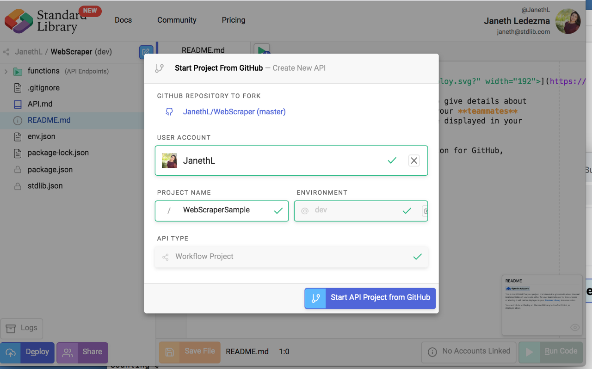
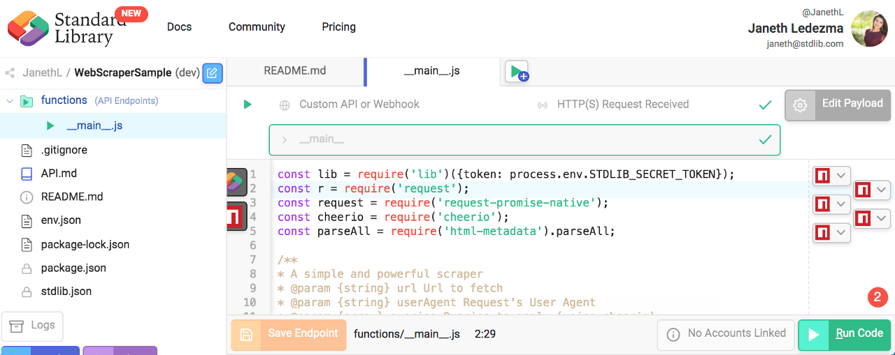
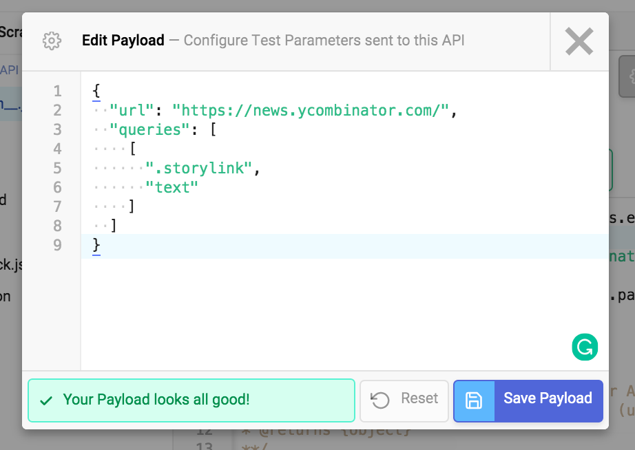
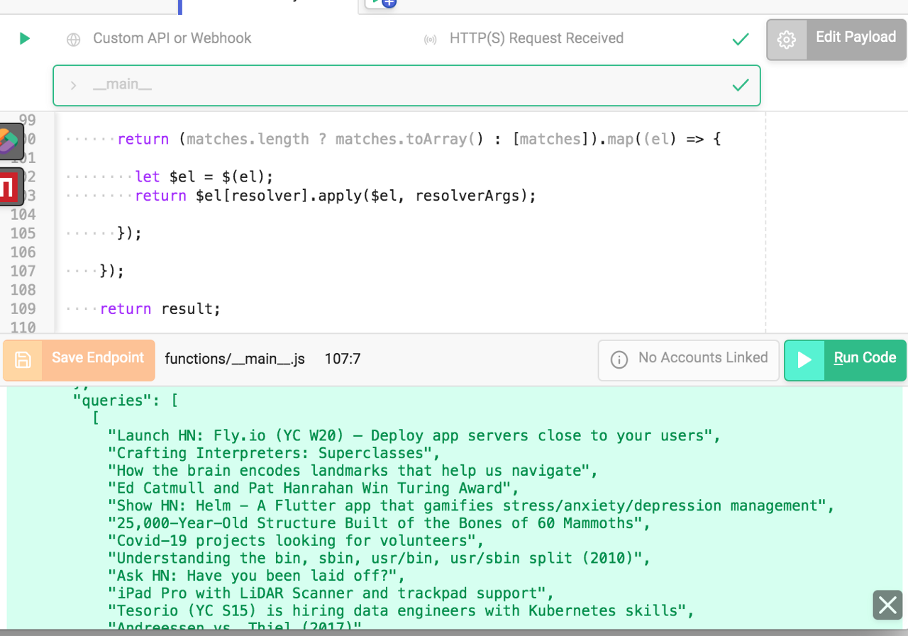
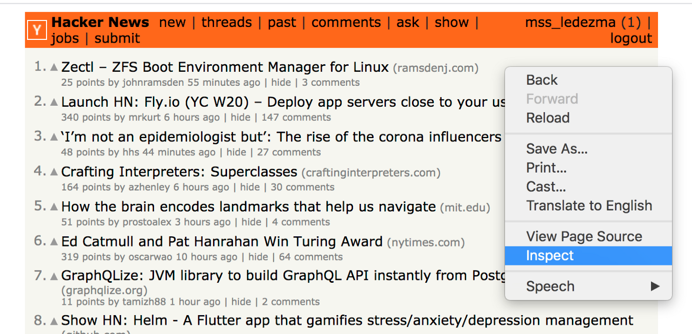
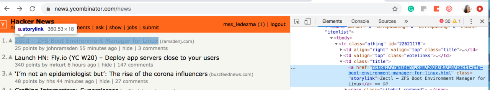
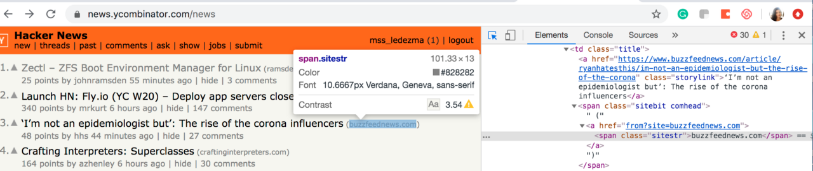
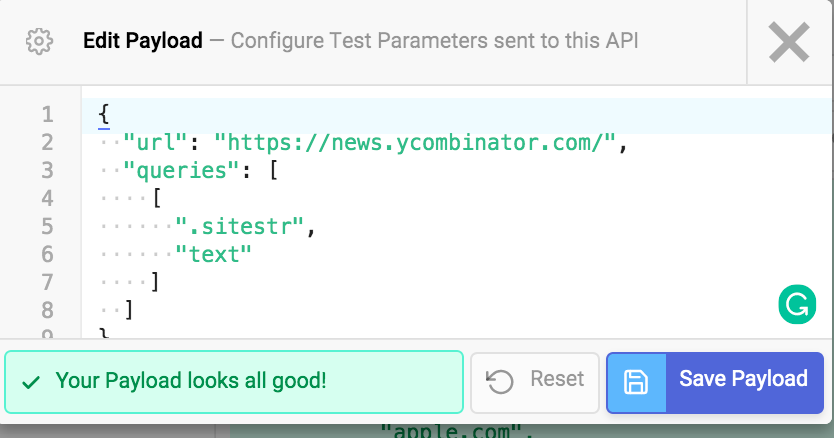
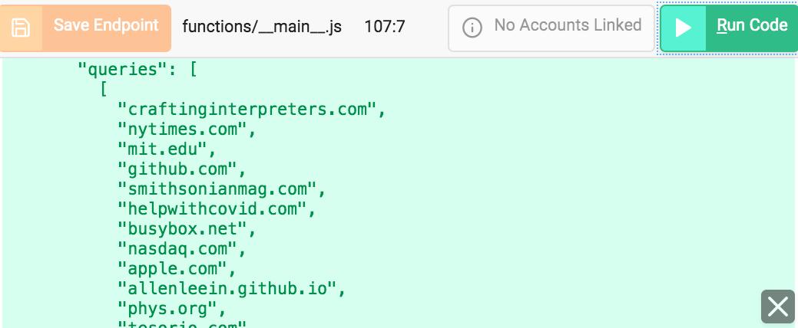

# README
[](https://deploy.stdlib.com/)

# How to Easily Scrape Websites for Data using Autocode

🏚 Scrape real estate listings - businesses are using web scraping to gather listed properties

🔎 Scrape products/product reviews from retailer or manufacturer websites to show in your site, provide specs/price comparison

📰 Scrape news websites to apply custom analysis and curation (manual or automatic), provide better-targeted news to your audience

💌 Gathering email addresses for lead generation

As a simple example - we'll scrape the front page of Hacker News to fetch the titles and urls of links. What you do with the data you scrape is totally up to you. You can aggregate data and perform custom analysis, store it in Airtable, GoogleSheets, or shoot it into Slack for your team to monitor. The possibilities are infinite.

# Table of Contents

1. [Installation](#installation)
1. [How It Works](#how-it-works)
1. [How to Query Using CSS Selectors](#how-to-query-using-css-selectors) 
1. [Making Changes](#making-changes)
   1. [via Web Browser](#via-web-browser)
   1. [via Command Line](#via-command-line)
1. [Shipping to Production](#Shipping-to-Production)
1. [Support](#support)
1. [Acknowledgements](#acknowledgements)

# Installation

Select Open in Autocode Button:

[](https://deploy.stdlib.com/)

You will be prompted to sign in or create a **free account**. If you have a Standard Library account click **Already Registered** and sign in using your Standard Library credentials.

Once you sign in, give your project a name and click **Start API Project from Github**.




Navigate through the `Functions folder` to `_main_.js` file. 



Next, select the gray **Edit Payload** button on the upper-right side of the screen to set parameters: `url` and `queries`.
Copy and Paste the following test parameters in the **Edit Payload** screen:

``` json
{
  "url": "https://news.ycombinator.com/",
  "queries": [
    [
      ".storylink",
      "text"
    ]
  ]
}
```
Click **Save Payload**:



Select the green "**Run**" button to test run your code.



Within seconds you should have a list of link titles from the front page of [Hacker News](https://news.ycombinator.com/).

# How It Works

The web scraper makes a simple GET request to a URL, and runs a series of queries on the resulting page and returns it to you. 
It uses cheerio DOM (Document Object Model) processor, enabling us to use CSS-selectors to grab data from the page. CSS
selectors are patterns used to select the element(s) you want to organize.

# How to Query Using CSS Selectors

Web pages are written in markup languages such as HTML An [HTML element](https://www.w3schools.com/Html/html_elements.asp]) is one component of an HTML document or web page. Elements define the way information is displayed to the human eye on the browser- information such as images, multimedia, text, style sheets, scripts etc.

For this example, we used the [".class" selector](https://www.w3schools.com/cssref/css_selectors.asp) (class = ".storylink" ) to fetch the titles of all hyperlinks from all elements in the front page of Hacker News.

If you are wondering how to find the names of the elements that make up a website - allow me to show you!
Fire up [Google Chrome](https://www.google.com/chrome/?brand=CHBD&gclid=EAIaIQobChMI87WK1Iya3AIVh_hkCh1hMgIIEAAYASAAEgKilfD_BwE&gclsrc=aw.ds&dclid=CLuW3dWMmtwCFcq5ZAodXTwHBA) and type in our [Hacker News](https://news.ycombinator.com/) URL address https://news.ycombinator.com/. Then right-click on the title of any article and select "inspect." This will open the Web Console on Google Chrome. Or you can use **command key (⌘) + option key (⌥ ) + J key.**



The web-developer console will open to the right of your screen. Notice that when you selected the title of a link a section on the console is also highlighted. The highlighted element has "class" defined as "storylink." And now you know how to find the names of elements on any site!




If you want to query different metadata on Hacker News, hover your cursor over it. Below you can see how that I found the .class selector = "sitestr" to query a link's URL by hovering my mouse over that element on Hacker News.




Update your Test Parameters with the .class you want to retrieve and hit **Save Payload.**




Test Run your code again and you should see a list of URLs.



You are ready to deploy your web scraper live! 

Select Deploy API in the bottom-left of the file manager.


🚀 Congrats! Your website scraper is Live!

# Making Changes

There are two ways to modify your application. The first is via our in-browser
editor, [Autocode](https://autocode.com/). The second is
via the [Standard Library CLI](https://github.com/stdlib/lib).

## via Web Browser

Simply visit [`Autocode.com`](https://autocode.com) and select your project. 
You can easily make updates and changes this way, and deploy directly from your browser.

## via Command Line

You can install the CLI tools from [stdlib/lib](https://github.com/stdlib/lib) to test,
makes changes, and deploy.


To retrieve your package via `lib get`...

```shell
lib get <username>/<project-name>@dev
```

```shell
# Deploy to dev environment
lib up dev
```

# Shipping to Production

Standard Library has easy dev / prod environment management, if you'd like to ship to production,
visit [`build.stdlib.com/projects`](https://build.stdlib.com/projects),
find your project and select it.

From the environment management screen, simply click **Ship Release**.


Link any necessary resources, specify the version of the release and click **Create Release** to proceed. 

That's all you need to do!

# Support

Via Slack: [`libdev.slack.com`](https://libdev.slack.com/)

You can request an invitation by clicking `Community > Slack` in the top bar
on [`https://stdlib.com`](https://stdlib.com).

Via Twitter: [@SandardLibrary](https://twitter.com/StandardLibrary)

Via E-mail: [support@stdlib.com](mailto:support@stdlib.com)

# Acknowledgements

Thanks to the Standard Library team and community for all the support!

Keep up to date with platform changes on our [Blog](https://stdlib.com/blog).

Happy hacking!
